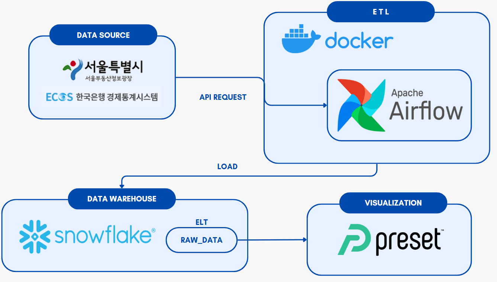
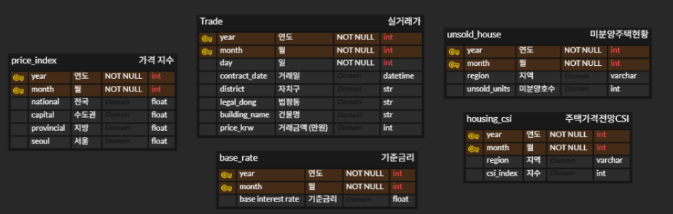

# AptScope
## 1. 프로젝트 개요
### ✅ 주제
- 서울 지역 아파트 매매가격에 영향을 미치는 경제 지표 분석 및 시각화

### ❓주제 선정 배경
- 최근 몇 년간 기준금리 인상, 물가 상승, 가계부채 증가 등 경제 전반의 변화가 부동산 시장에 직접적인 영향을 미치고 있고, 특히 서울은 지방에 비해 아파트 매매가격이 높음
- 서울 지역을 중심으로 아파트 매매가격과 기준금리, 소비자물가지수 등의 주요 경제지표 간의 연관성을 분석하고 시각화하여 의사결정에 도움이 되는 인사이트를 도출하고자 함

### 🎯 기대 효과
- 최신 금융 및 부동산 데이터를 자동으로 수집 및 가공하는 데이터 파이프라인 구축
- 서울 아파트 매매가격과 주요 경제지표 간의 시계열 분성르 통한 시장의 변화 흐름 파악
- Preset 대시 보드를 통한 서울 내 자치구별 아파트 매매가격 및 거래건수 시각화로 비교 분석
- 향후 정책 평가, 투자 판단, 지역간 격차 분석 등 다양한 실무로의 적용 가능성 제공

### 📅 프로젝트 기간
- 2025.06.04 ~ 2025.06.11

## 2. 프로젝트 구조
### ⚙️ 시스템 구조도

### 🔗 ERD

### 🛠️ 기술 스택
- 언어: Python
- 자동화: Apache Airflow
- 데이터 웨어하우스: Snowflake
- 시각화: Preset
- 협업: Notion, Slack, Zep, ERD Cloud, GitHub

### ✏️ 사용 데이터
- 데이터 소스: 한국은행 경제통계시스템, 서울부동산정보광장
- 데이터 전처리: 실거래가 정보, 기준금리, 주택가격전망 CSI, 가격 지수, 미분양 주택현황

### ❤️ 팀원 및 역할
- 박범수: Airflow를 통한 가격 지수 데이터 ETL/ELT 작업 및 대시보드 시각화
- 박상희: Airflow를 통한 실거래가 데이터 ETL/ELT 작업 및 대시보드 시각화
- 박시영: Airflow를 통한 주택전망CSI 및 미분양 주택 현황 데이터 ETL/ELT 작업 및 대시보드 시각화
- 양창우: Airflow를 통한 기준 금리 데이터 ETL/ELT 작업 및 대시보드 시각화
